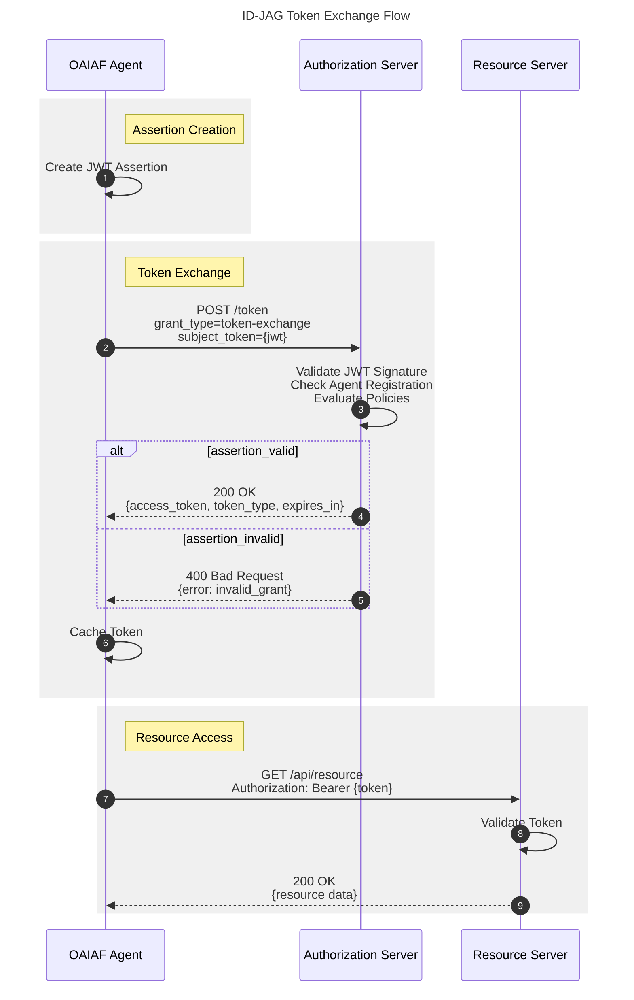
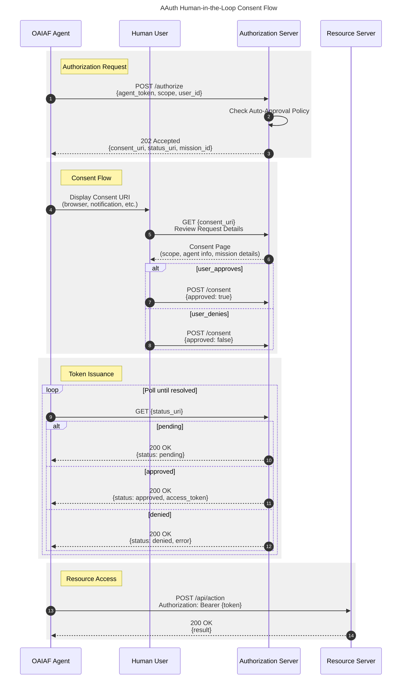
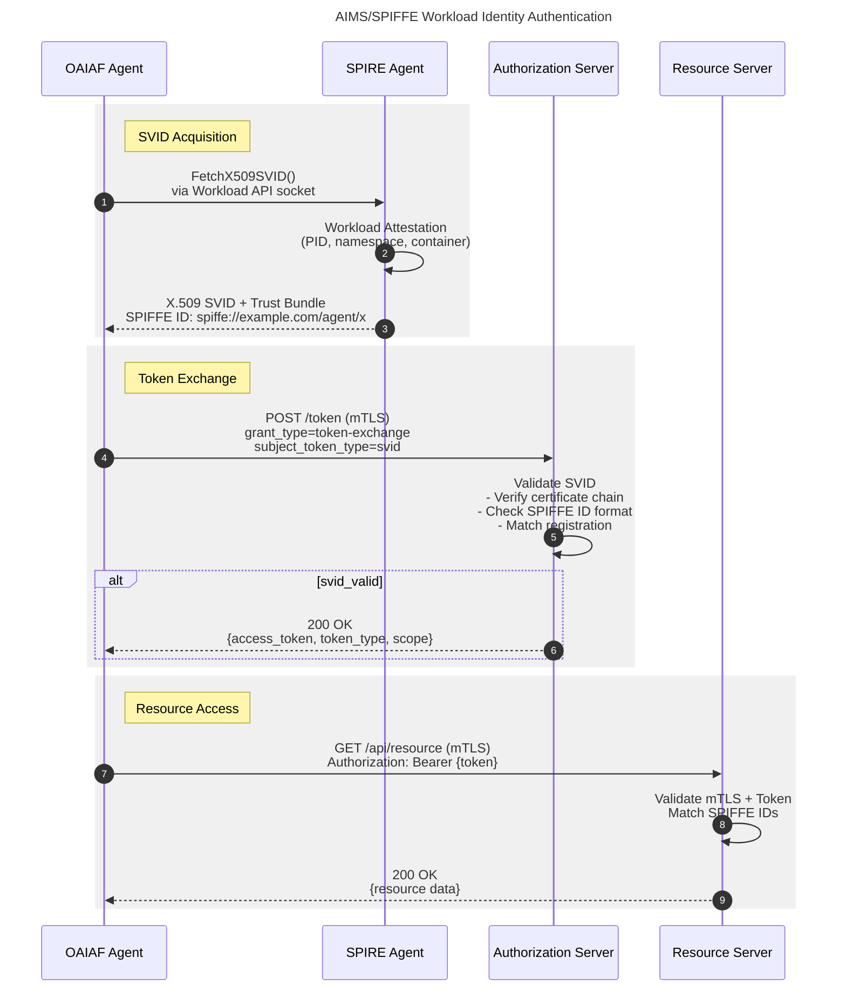
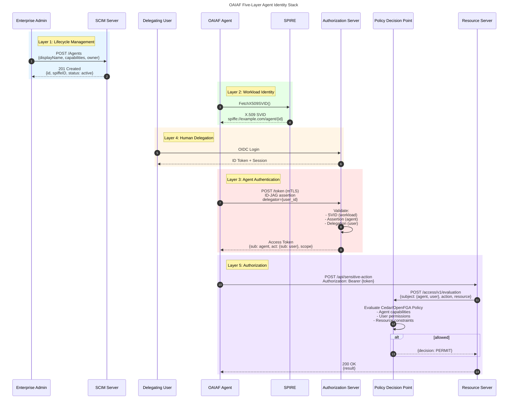
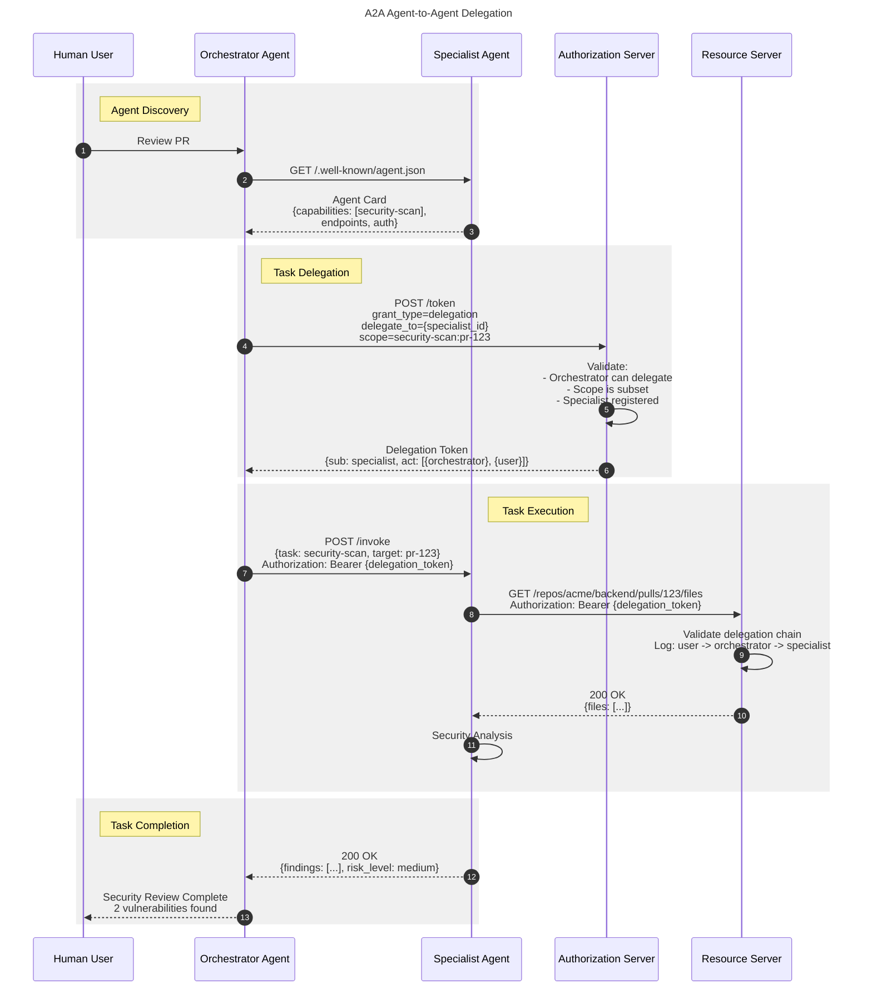
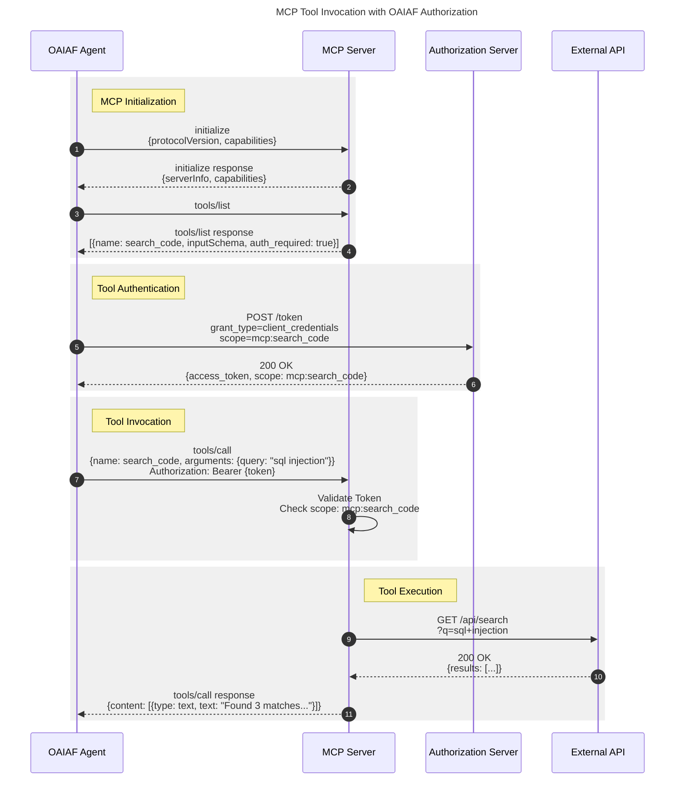

# OAIAF Protocol Flows

This document provides detailed sequence diagrams for the authorization protocols supported by OAIAF. Each flow is defined using [PIDL](https://github.com/grokify/pidl) (Protocol Interaction Description Language) and rendered as Mermaid sequence diagrams.

## Overview

OAIAF supports three core authorization protocols:

| Protocol | Use Case | Human Interaction |
|----------|----------|-------------------|
| [ID-JAG](#id-jag-token-exchange) | Automated, policy-based authorization | None |
| [AAuth](#aauth-consent-flow) | Sensitive operations requiring approval | Consent flow |
| [AIMS/SPIFFE](#aimsspiffe-authentication) | Workload identity binding | None |

These protocols can be combined to implement the [Five-Layer Agent Identity Stack](#agent-identity-stack).

## ID-JAG Token Exchange

ID-JAG (Identity Assertion Authorization Grant) enables agents to exchange signed JWT assertions for access tokens without human interaction. This is ideal for automated pipelines and trusted operations.

**Key Characteristics:**

- Agent signs JWT assertion with its private key
- Authorization server validates signature and agent registration
- No human consent required (policy-based)
- Tokens cached by scope for efficiency

**OAIAF Implementation:** `IDJAGProvider`



**Go Example:**

```go
agent := oaiaf.NewAgent("my-agent",
    oaiaf.WithAuthServer("https://auth.example.com"),
    oaiaf.WithCredentials(privateKey, keyID),
    oaiaf.WithProtocol(oaiaf.ProtocolIDJAG),
)

resp, err := agent.AuthorizedRequest(ctx, "read:email", req)
```

## AAuth Consent Flow

AAuth (Agent Authorization) provides human-in-the-loop consent for sensitive operations. The agent requests authorization, and a human must approve before access is granted.

**Key Characteristics:**

- Consent required for sensitive scopes
- Polling-based status updates
- Mission-scoped tokens
- Full audit trail

**OAIAF Implementation:** `AAuthProvider`



**Go Example:**

```go
provider := oaiaf.NewAAuthProvider(agent)
provider.ConsentHandler = func(consentURI string) (bool, error) {
    fmt.Printf("Approve at: %s\n", consentURI)
    return waitForUserApproval()
}
provider.Timeout = 10 * time.Minute

agent := oaiaf.NewAgent("my-agent",
    oaiaf.WithAuthServer("https://auth.example.com"),
    oaiaf.WithProvider(provider),
)

resp, err := agent.AuthorizedRequest(ctx, "mission:deploy:staging", req)
```

## AIMS/SPIFFE Authentication

AIMS (Agent Identity and Messaging System) uses SPIFFE workload identity to bind agents to their infrastructure. X.509 SVIDs provide cryptographic proof of workload identity.

**Key Characteristics:**

- Zero-trust workload identity
- Short-lived, auto-rotated certificates
- mTLS for transport security
- Defense in depth (mTLS + bearer token)

**OAIAF Implementation:** `AIMSProvider`



**Go Example:**

```go
provider := oaiaf.NewAIMSProvider(agent,
    oaiaf.WithSPIFFEID("spiffe://example.com/agent/my-agent"),
    oaiaf.WithTrustBundle(trustBundle),
    oaiaf.WithSVID(certificate),
)

// Or fetch from SPIRE Workload API
provider := oaiaf.NewAIMSProvider(agent,
    oaiaf.WithWorkloadSocket("/var/run/spiffe/agent.sock"),
)

agent := oaiaf.NewAgent("my-agent",
    oaiaf.WithAuthServer("https://auth.example.com"),
    oaiaf.WithProvider(provider),
)
```

## Agent Identity Stack

The complete five-layer identity stack combines all protocols for enterprise-grade agent authorization:

1. **Lifecycle (SCIM)** - Agent provisioning and management
2. **Workload Identity (SPIFFE)** - Infrastructure binding
3. **Agent Authentication (AAuth)** - Agent identity token
4. **Human Delegation (ID-JAG)** - Authority chain
5. **Authorization (AuthZEN)** - Fine-grained access control



## A2A Agent Delegation

A2A (Agent-to-Agent) protocol enables agents to discover and delegate tasks to other agents while maintaining accountability.



## MCP with OAIAF Authorization

MCP (Model Context Protocol) tool invocation integrated with OAIAF authorization.



## PIDL Source Files

The diagrams in this document are generated from PIDL source files located in `docs/diagrams/pidl/`:

| File | Protocol |
|------|----------|
| [`idjag_token_exchange.pidl.json`](diagrams/pidl/idjag_token_exchange.pidl.json) | ID-JAG Token Exchange |
| [`aauth_consent_flow.pidl.json`](diagrams/pidl/aauth_consent_flow.pidl.json) | AAuth Consent Flow |
| [`aims_spiffe_auth.pidl.json`](diagrams/pidl/aims_spiffe_auth.pidl.json) | AIMS/SPIFFE Authentication |
| [`agent_identity_stack.pidl.json`](diagrams/pidl/agent_identity_stack.pidl.json) | Five-Layer Identity Stack |
| [`a2a_delegation.pidl.json`](diagrams/pidl/a2a_delegation.pidl.json) | A2A Agent Delegation |
| [`mcp_with_auth.pidl.json`](diagrams/pidl/mcp_with_auth.pidl.json) | MCP with OAIAF Auth |

To regenerate diagrams:

```bash
# Install PIDL
go install github.com/grokify/pidl/cmd/pidl@latest

# Generate Mermaid
pidl generate -f mermaid docs/diagrams/pidl/idjag_token_exchange.pidl.json

# Generate PlantUML
pidl generate -f plantuml docs/diagrams/pidl/idjag_token_exchange.pidl.json
```

## References

- [ID-JAG Specification](https://datatracker.ietf.org/doc/draft-ietf-oauth-identity-assertion-authz-grant/)
- [AAuth Protocol](https://datatracker.ietf.org/doc/draft-hardt-oauth-aauth-protocol/)
- [SPIFFE](https://spiffe.io/)
- [A2A Protocol](https://github.com/a2a-protocol/a2a)
- [Model Context Protocol](https://spec.modelcontextprotocol.io/)
- [AuthZEN](https://openid.net/specs/openid-authzen-authorization-api-1_0.html)
- [PIDL](https://github.com/grokify/pidl)
